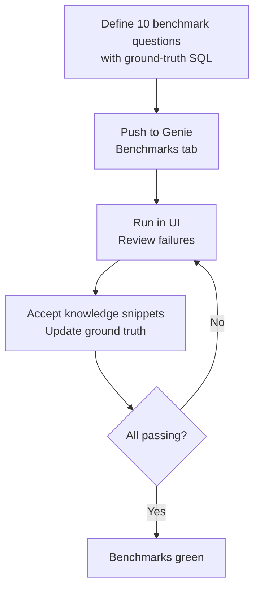
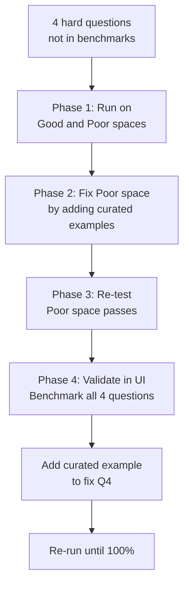

# Databricks Genie Workshop — Manufacturing Quality Analytics

A hands-on workshop that teaches you how to build, evaluate, and optimize a
**Databricks Genie** space for manufacturing analytics. You will create a
fully configured AI assistant that answers natural-language questions about
OEE, defect rates, scrap, downtime, and safety — then prove its accuracy
with automated benchmarks.

## Workshop flow

```mermaid
flowchart LR
    subgraph data ["1. Data"]
        NB01["01 Load Data"]
        NB02["02 Prepare Tables"]
    end
    subgraph genie ["2. Build Genie"]
        NB03["03 Create Spaces"]
        NB04["04 Benchmarks"]
        NB05["05 Explore"]
        NB06["06 Code Skills"]
    end
    subgraph prove ["3. Prove It"]
        NB07["07 A/B Compare"]
    end
    subgraph govern ["4. Govern & Deploy"]
        NB08["08 Security"]
        NB09["09 App"]
        NB10["10 Monitoring"]
        NB11["11 CI/CD"]
    end

    NB01 --> NB02 --> NB03 --> NB04 --> NB05 --> NB06 --> NB07 --> NB08 --> NB09 --> NB10 --> NB11
```



## What you will walk away with

- **A production-ready Genie space** with curated instructions, Q-to-SQL examples, and benchmarks that answer manufacturing questions accurately.
- **Proof that curation matters** (Notebook 07) — the same 4 hard questions pass on a configured space and fail on a blank one, showing that investing in examples and instructions is the difference.
- **A repeatable evaluation workflow** (Notebook 04) — push benchmarks, run them in the UI, review failures with knowledge snippets, and iterate until 100%.
- **A Genie Code skill** (Notebook 06) — a reusable domain knowledge file that lets you create new spaces from a simple prompt, no API code required.
- **Security guardrails** (Notebook 08) — column masking with Unity Catalog, proving Genie respects row/column security policies.
- **A deployable app** (Notebook 09) — Genie wrapped in a branded Databricks App your users can access directly.

## Prerequisites

- Databricks workspace with **Unity Catalog** and **Genie** enabled
- A catalog and schema where you have `CREATE TABLE`, `CREATE VOLUME`, and `CREATE FUNCTION` permissions
- A running **SQL warehouse** (serverless or Pro)
- **Serverless** notebook compute (or a classic cluster with Unity Catalog access)

## Getting started

1. Import the **`notebooks/`**, **`templates/`**, **`skill/`**, and **`app/`** folders into your Databricks workspace so they sit side-by-side:

   ```
   /Workspace/Users/<your_email>/GM-Genie-Workshop/
     notebooks/        ← 13 notebooks (00–12)
     templates/        ← Genie space configuration
     skill/            ← Genie Code skill file
     app/              ← Databricks App source
   ```

2. Open **`00_workshop_config`** and set your **catalog** and **schema**.

3. Run notebooks **01 → 12** in order. Every notebook reads your config
   automatically via `%run ./00_workshop_config`.

> **Tip:** After notebook 01's `%pip install`, Python restarts. Re-run the
> config cell in that notebook, then continue.

## Notebooks

| # | Notebook | What you will do |
|---|----------|-----------------|
| 00 | **Workshop Config** | Set your catalog, schema, and preferences |
| 01 | **Load Data** | Create 7 manufacturing tables (plants, lines, operators, events, quality metrics, safety, feedback) |
| 02 | **Prepare Data** | Add column comments, create analytics functions |
| 03 | **Create Genie Spaces** | Create 3 spaces (Blank, Configured, No Examples) |
| 04 | **Benchmarks** | Push 10 benchmark questions to the Genie Benchmarks tab, run in the UI, fix failures with knowledge snippets and ground truth updates |
| 05 | **Explore with Genie** | Ask questions in the Genie UI, verify with reference SQL and programmatic spot checks |
| 06 | **Code Skills** | Use a Genie Code skill and a prompt to create a Genie space — no API code needed |
| 07 | **A/B Compare** | Prove curated examples matter: run 4 hard questions on both spaces, fix the poor space, then validate in the UI with benchmarks and knowledge snippets |
| 08 | **Security** | Column masking with Unity Catalog — prove Genie respects row/column security |
| 09 | **Deploy App** | Wrap Genie in a branded Databricks App |
| 10 | **Monitoring** | Track accuracy, usage, and query performance over time |
| 11 | **CI/CD** *(optional)* | Promote Genie spaces across environments with code |
| 12 | **Cleanup** *(optional)* | Remove all workshop assets |

## How the evaluation works

**Notebook 04** defines 10 benchmark questions that teach Genie the right SQL patterns:



**Notebook 07** uses 4 harder questions to prove curated examples matter:



The 10 benchmarks **teach patterns** (state joins, ratio calculations, shift
aggregation) using different filters and time ranges. The 4 evaluation
questions in notebook 07 are intentionally **different** -- Genie must
generalize from the patterns, not memorize answers.

## Notebook-specific notes

- **06 — Skills:** Copy `skill/manufacturing-analytics_genie/SKILL.md` into your workspace's `.assistant/skills/` directory before running notebook 06.
- **08 — Security:** Replace `admin_group` with a real group in your workspace.
- **09 — App:** Uses `app/app.py`, `app.yaml`, and `requirements.txt`.
- **10 — Monitoring:** Queries `system.access.audit` and `system.query.history`; the notebook handles missing access gracefully.

## Repository structure

```
├── notebooks/          13 workshop notebooks (00–12)
├── templates/          Genie space configuration template
│   └── manufacturing_genie_configured.json
├── skill/              Genie Code skill file
│   └── manufacturing-analytics_genie/
│       └── SKILL.md
├── app/                Databricks App source
│   ├── app.py
│   ├── app.yaml
│   └── requirements.txt
└── README.md
```

## Compute

All notebooks run on **Serverless** compute. Classic clusters with Unity Catalog access also work.

## Troubleshooting

| Symptom | Fix |
|---------|-----|
| Notebook 03 fails to create spaces | Check Genie entitlement, SQL warehouse availability, and API permissions. |
| Wrong catalog in Genie answers | Ensure notebook 00 has the same catalog/schema you used in 01–02. |
| Notebook 01 fails after pip install | After `%pip`, Python restarts. Re-run the config cell, then continue. |
| Notebook 07 `FileNotFoundError` | The `templates/` folder must be at the same level as `notebooks/`. |
| Benchmarks in wrong UI tab | Notebook 04 uses the `data-rooms` API for benchmarks. If benchmarks appear under "SQL Queries," re-run notebook 04. |

## License and data

Sample data is **synthetic** — generated for training and demos, not real
production or customer data.
